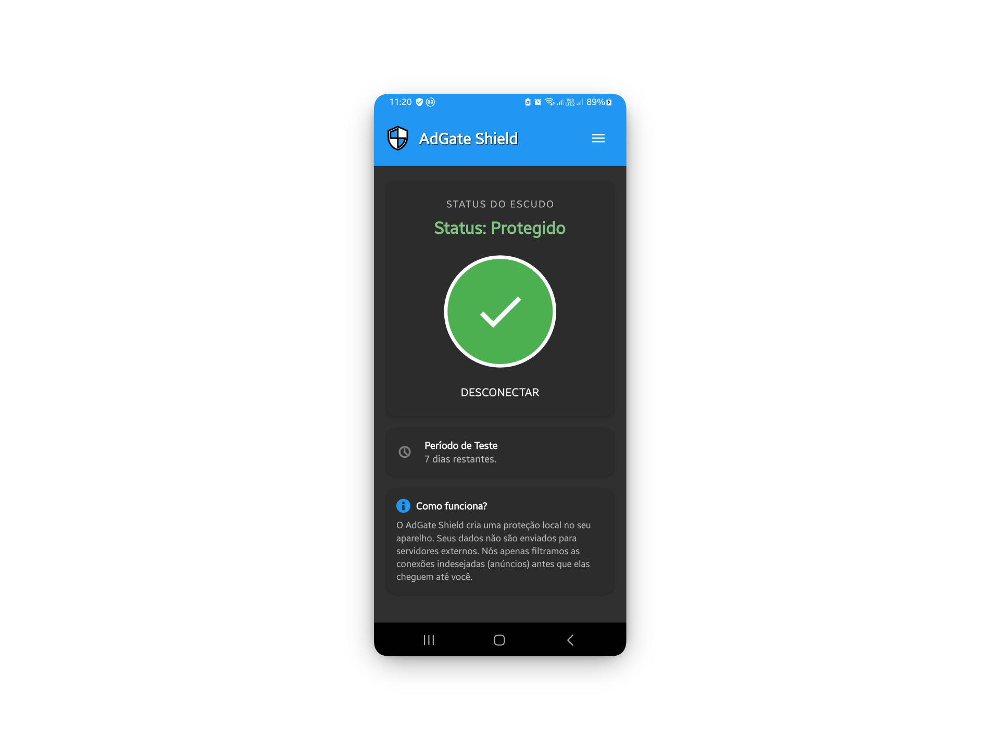
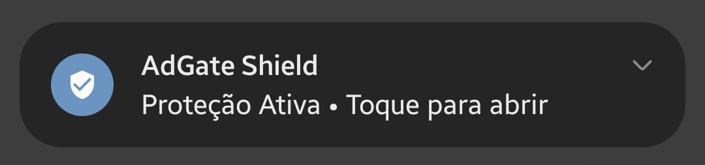

# 🛡️ AdGate Shield
### (AGS Block)

> **"Retoma el control de tu Android. Privado, Rápido y Limpio."**

<h3>
  <a href="README.md">🇺🇸 Read in English</a> | 
  <a href="README.pt-br.md">🇧🇷 Ler em Português</a>
</h3>

 

**[ INSERTAR IMAGEN DEL BANNER AQUÍ ]**

 

[⬇️ DESCARGAR ÚLTIMA VERSIÓN](https://github.com/sys72/AdGate-Shield/releases/latest) | [🐛 REPORTAR BUG](https://github.com/sys72/AdGate-Shield/issues)

---

## ⚡ ¿Qué es AdGate Shield?

**AdGate Shield (AGS Block)** es una herramienta profesional diseñada para filtrar el tráfico de internet directamente en tu dispositivo.

Piénsalo como un **cortafuegos digital**: se sitúa entre tus aplicaciones e internet, bloqueando anuncios, rastreadores y sitios maliciosos *antes* de que carguen.

### 🚀 ¿Por qué lo necesitas?

| 🟢 Para Todos (Simplicidad) | 🔴 Para Técnicos (Potencia) |
| :--- | :--- |
| **Plug & Play:** Solo un botón para activar. Sin configuraciones complejas. | **Kotlin Native:** Motor reescrito para máximo rendimiento. |
| **Ahorro de Datos:** No gastes tu 4G/5G cargando videos publicitarios. | **Local Loopback:** Filtrado con latencia cero sin servidores externos. |
| **Batería:** Operación silenciosa optimizada para pantallas AMOLED. | **Privacidad:** Sin registros, sin recolección de datos. |

---

## 📸 Interfaz y Experiencia

Diseñado con un enfoque en el **Modo Oscuro (Dark Mode)** y retroalimentación visual minimalista.

  <table>
    <tr>
      <td align="center"><b>Modo de Espera</b></td>
      <td align="center"><b>Protección Activa</b></td>
      <td align="center"><b>Menú de Control</b></td>
    </tr>
    <tr>
      <td align="center"></td>
      <td align="center"></td>
      <td align="center"></td>
    </tr>
  </table>

### 👻 Operación Silenciosa
La aplicación se ejecuta eficientemente en segundo plano con una notificación persistente discreta.

  

---

## 🔒 Seguridad y Privacidad (La Parte Técnica)
AdGate Shield opera creando una **interfaz VPN local**.
- **Sin Servidores Externos:** Tus datos nunca salen de tu teléfono para ser filtrados en la nube. Todo ocurre dentro de tu CPU.
- **Filtrado DNS:** Usamos reglas estrictas (Base AdGuard) para asegurar un bloqueo máximo sin romper sitios.
- **Persistencia OneUI/MIUI:** Algoritmos personalizados para evitar que el sistema de Samsung o Xiaomi cierre la protección.

---

## 🛠️ Instalación

1. Ve a la pestaña **[Releases](https://github.com/sys72/AdGate-Shield/releases)**.
2. Descarga el archivo `.apk` más reciente.
3. Instala y concede el permiso de **Conexión VPN**.
4. Disfruta de un internet más limpio.

---

Desarrollado con ❤️ por <b>Sys72</b>

